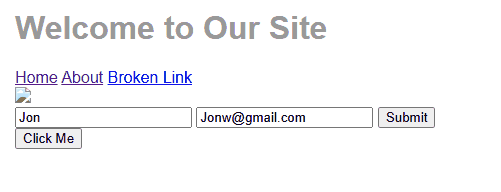
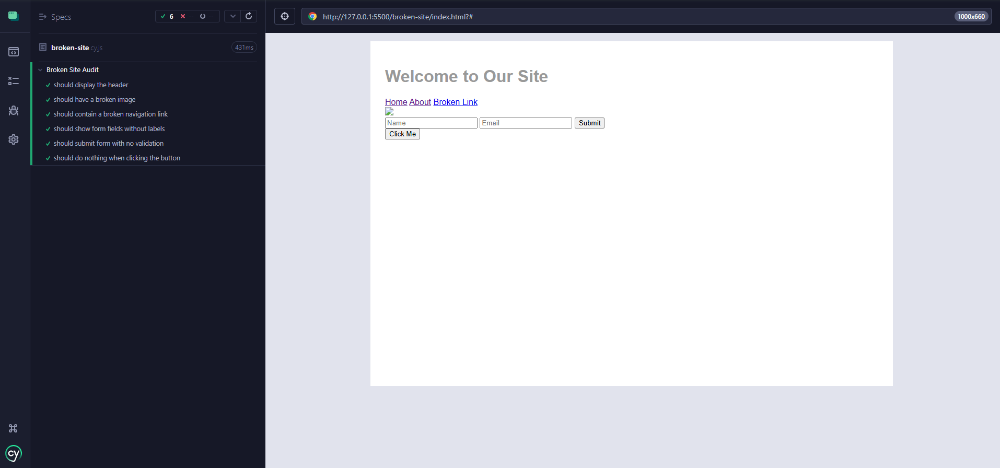

# 🧪 QA Site Audit – Manual & Automated Testing Portfolio Project

Welcome to my QA audit project! This repo showcases my ability to identify, document, and automate UI and accessibility issues using both **manual test cases** and **Cypress automation**.

This project simulates a broken website full of common issues — the perfect playground for a thorough QA analysis.

---

## 🔍 Project Overview

- **Site audited:** `/broken-site/index.html`
- **Tech used:** HTML, CSS
- **Testing tools:** Cypress, Manual QA, Markdown
- **Focus areas:** Accessibility, usability, form behavior, broken UI

---

## ✅ What’s Included

### 🗂 `/manual-qa-audit/`
Manual test cases and bug reports with clear pass/fail results.

- `test-cases.md` – step-by-step manual test scenarios
- `bug-reports/` – individual markdown files for each bug found
- Screenshots documenting UI issues

---

### ⚙️ `/cypress/`
Automated test suite using Cypress.

- `broken-site.cy.js` – Cypress test cases for broken links, missing images, non-functional buttons, and more
- `screenshots/` – Cypress test runner in action
- `README.md` – describes how to run the tests locally



---

## 📸 Preview

Cypress running the automated tests:



---

## 🚀 How to Run This Project

### 🔧 Requirements
- Node.js (v16+)
- VS Code or terminal
- Live Server (or any static server)

### 🔨 Install Cypress
```bash
npm install
npx cypress open
