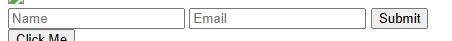

# 🐞 Bug Report – Form Inputs Missing Labels

## Summary
Form fields are missing associated `<label>` elements.

## Steps to Reproduce
1. Inspect the form inputs for Name and Email

## Expected Result
Each input should have an associated `<label>` for accessibility

## Actual Result
Inputs use `placeholder` only; no `<label>` present

## Severity
High – fails accessibility and screen reader usability

## Screenshot

